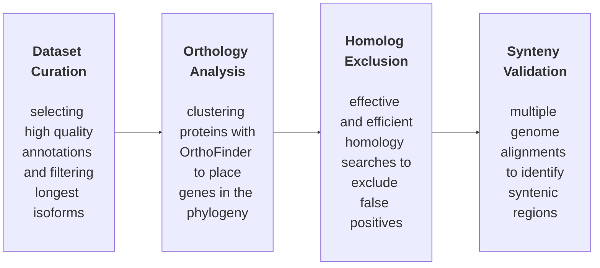
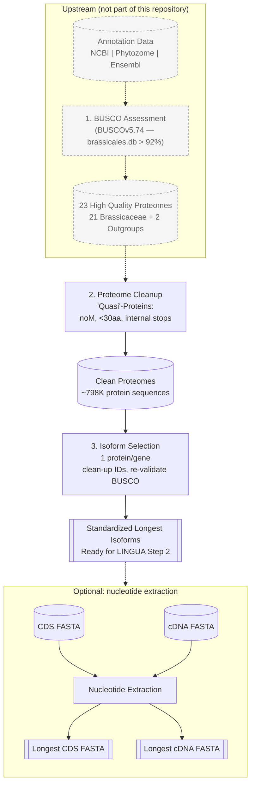

# Protein Preprocessing & Isoform Selection Pipeline

A reproducible pipeline for turning per-species GFF and protein FASTA files into standardized, non-redundant proteomes through biologically informed filtering and isoform normalization, for use in multi-species comparative genomics.

## Rationale

Comparative genomics workflows depend on consistent, high-quality protein datasets. Publicly available proteomes often contain redundant isoforms per gene, incomplete or low-quality annotations, non-functional or truncated protein sequences, and inconsistencies across source databases (NCBI, Ensembl, Phytozome).

These inconsistencies propagate into downstream analyses, including orthology inference, gene age estimation, de novo gene detection, and synteny-based validation. This pipeline provides a standardized preprocessing step for constructing biologically consistent proteomes before those analyses run.

## Input expectations

This tool starts from GFF and protein FASTA files you already have. It does not download, select, or assess the completeness of proteomes — that curation (e.g., choosing which assemblies to include, or running BUSCO to filter out low-completeness proteomes against a lineage-specific dataset) is expected to happen upstream, before files are handed to this pipeline. What this repository actually implements is described below.

## Methodological overview

**1. Protein-level quality control.** Sequences are filtered for three defects: no start codon (methionine), length below a minimum cutoff (30 amino acids by default), and internal stop codons. This step produces a clean proteome suitable for evolutionary analysis.

**2. Isoform normalization.** The longest protein isoform per gene is selected, gene identifiers are standardized, and redundant isoforms are removed so each gene is represented by exactly one protein.

**3. Nucleotide sequence extraction (optional).** The longest CDS and corresponding cDNA sequences are extracted for the selected isoforms, preserving the link between protein and nucleotide data for analyses that need it.

## Outputs

- Standardized longest protein isoforms (FASTA)
- Longest CDS sequences (FASTA, optional)
- Longest cDNA sequences (FASTA, optional)
- Summary statistics and QC reports (TSV)

These outputs are intended for orthology inference (e.g., OrthoFinder), other comparative genomics pipelines, de novo gene detection workflows, and machine learning applications on genomic data.

`master_summary_report.tsv` includes two columns, `N_Cleaned_Proteins` and `N_Isoform_Step_Input`, that should always be equal. They are computed independently — the first by the QC step counting what it wrote, the second by the isoform-selection step counting what it read from the same cleaned FASTA file. This is a deliberate built-in cross-check, not a duplicate column: if the two ever diverge for a species, it means the isoform-selection step read a different file than the QC step actually produced, and that row is worth investigating before trusting its results.

## Pipeline overview

### Full LINGUA workflow



### Step 1: dataset curation and preprocessing

Species selection and BUSCO-based completeness assessment (shown greyed out below) happen upstream, before files reach this pipeline — see "Input expectations" above. This repository starts from already-selected annotation and protein FASTA files.



## Role in the LINGUA framework

This repository is Stage 1 (Dataset Curation and Preprocessing) of the LINGUA comparative genomics pipeline:

1. Dataset curation (this repository)
2. Orthology analysis (gene clustering across species)
3. Homolog exclusion (removal of false positives)
4. Synteny validation (genome alignment-based validation)

This module is standalone and can be used independently of the rest of the LINGUA framework.

## Requirements

- bash 4.3 or later
- GNU coreutils (`readlink -f`, `mktemp`) — standard on Linux and WSL; not present in stock macOS bash without `brew install coreutils`
- Python 3.7 or later, available on `PATH` as `python3`
- `awk`, `grep`

There are no third-party Python dependencies; the pipeline uses only the standard library.

Tested on Linux and WSL, which is where the pipeline is intended to run (including HPC cluster login/compute nodes — nothing here requires a specific scheduler or module system). It also runs under Git Bash on Windows, though `python3` may need to be on `PATH` explicitly since some Windows Python installs only register as `python`. It will not run in a native Windows shell (cmd.exe or PowerShell) without WSL or Git Bash, since it is a bash script.

## Getting the pipeline

```bash
git clone https://github.com/Ludtson/protein-preprocessing-isoform-pipeline.git
cd protein-preprocessing-isoform-pipeline
```

## Quick start

```bash
bash scripts/longest_protein_pipeline.sh \
  -g example_data/gff \
  -f example_data/protein \
  -o output_dir
```

With no `-m/--map-file` given, every FASTA file in `--fasta-dir` is processed, using its filename (without extension) as the species name. To run from a species map file instead (needed when species names differ from filenames, e.g. contain spaces):

```bash
bash scripts/longest_protein_pipeline.sh \
  -m species.map \
  -g example_data/gff \
  -f example_data/protein \
  -o output_dir
```

`species.map` is a tab- or comma-separated file with a header row and two columns: species name and file basename.

To tag output FASTA headers with the species name, add `--format-headers --add-species`. The species name used is the map-file entry when `-m` is given, or the filename (without extension) otherwise. See `bash scripts/longest_protein_pipeline.sh --help` for the full option list, including `--threads`, `--with-transcripts`, and `--keep_noM_only`.

### File naming and matching

Per species, input files across `--gff-dir`, `--fasta-dir`, `--cds-dir`, and `--cdna-dir` are paired by identical basename — e.g. `Athaliana.faa`, `Athaliana.gff`, `Athaliana.fna` (CDS), and `Athaliana.fasta` (cDNA) are all treated as the same species, regardless of which directory each lives in.

Accepted input extensions:

- Protein FASTA (`--fasta-dir`): tries `.faa`, `.fa`, `.fasta`, in that order, and uses the first match.
- GFF (`--gff-dir`): `.gff`, falling back to `.gff3` if the former isn't found.
- CDS (`--cds-dir`) and cDNA (`--cdna-dir`): each tries `.fna`, `.fa`, `.fasta`, in that order, and uses the first match.

If none of a species' required files (GFF and protein FASTA) can be found under any accepted extension, that species is skipped with a `[WARNING] Missing input files for <name> ...` line in `pipeline.log` naming the extensions that were tried — this applies whether you're running with `-m/--map-file` or discovering species directly from `--fasta-dir`.

Output naming is fixed regardless of the input extension: CDS output is always written as `<basename>.fna` under `6_longest_cds/`, and cDNA output is always `<basename>.cdna.fasta` under `7_longest_cdna/`.

## Reproducible example

The repository includes a small three-species test dataset for verifying pipeline behavior.

Dataset contents:

- `example_data/protein/` — input protein FASTA files
- `example_data/gff/` — gene annotation files
- `example_data/genome/` — genome FASTA files
- `example_data/test_run/` — expected outputs

Run the pipeline:

```bash
bash scripts/longest_protein_pipeline.sh \
  -g example_data/gff \
  -f example_data/protein \
  -o test_output
```

Validate results:

```bash
diff test_output/master_summary_report.tsv \
  example_data/test_run/master_summary_report.tsv
```

No output from `diff` means the run reproduced the expected result.

Inspect output:

```bash
head example_data/test_run/final_proteins/Athaliana_final.faa
```

This file contains the final filtered protein set, where each gene is represented by one protein that passed the QC filters.

This check is also run automatically in CI on every push and pull request (see `.github/workflows/ci.yml`).

## Notes on the example dataset

The example dataset is simplified for demonstration: genome FASTA files are truncated, GFF annotations are reduced, and optional features are not fully exercised. It is intended for quick testing, reproducibility checks, and demonstration, not as a realistic benchmark. The pipeline supports full datasets without modification.

## Pipeline components

### Orchestration (scripts/)

- `longest_protein_pipeline.sh` — main pipeline for multi-species preprocessing
- `qc_pipeline.sh` — standalone wrapper for batch protein quality control only

### Core utilities (bin/)

- `qc_proteins.py` — filters proteins based on biological criteria
- `select_longest_proteins.py` — selects the longest isoform per gene
- `fasta_header_tool.py` — cleans, tags, or strips species suffixes on FASTA headers
- `extract_longest_transcripts.py` — extracts CDS and cDNA sequences for selected isoforms
- `fasta_summary.py` — computes FASTA statistics
- `combine_datasets.py` — merges dataset summaries

## Directory structure

- `bin/` — Python utilities
- `scripts/` — pipeline execution scripts
- `example_data/` — test dataset and expected outputs
- `docs/` — figures and diagrams
- `README.md` — project documentation

Pipeline output directories follow a numbered convention reflecting the order of processing steps: `1_cleaned_proteins`, `2_qc_details`, `3_isoform_details`, `4_longest_proteins`, `5_final_proteins`, and, when `--with-transcripts` is used, `6_longest_cds` and `7_longest_cdna`.

## Design principles

- Modular and reusable components
- Reproducible workflows
- Scalable to multi-species datasets
- Biologically informed quality control
- Clean and consistent output formats

## Scope

Stage 1: dataset curation and proteome standardization.

Planned extensions:

- Orthology analysis (OrthoFinder-based clustering)
- Homolog filtering (false-positive removal)
- Synteny validation (genome alignment framework)

## Contributing

See [CONTRIBUTING.md](CONTRIBUTING.md) for how to run the reproducibility check, coding style expectations, and the pull request process.

## Citation

If you use this pipeline, please cite it via [CITATION.cff](CITATION.cff) (GitHub also surfaces this as a "Cite this repository" option on the repo page).

## License

MIT License. See [LICENSE](LICENSE).

## Acknowledgements

Casola Lab, Ecology & Conservation Biology Program, Texas A&M University.
