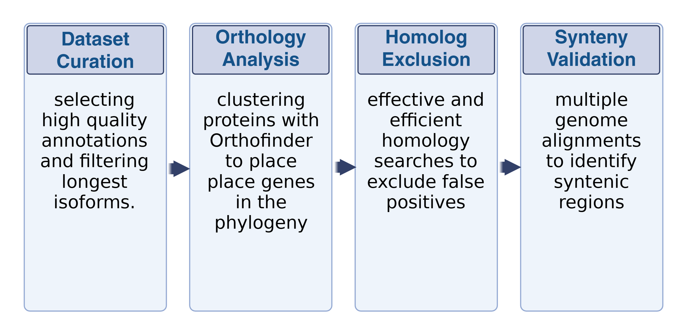
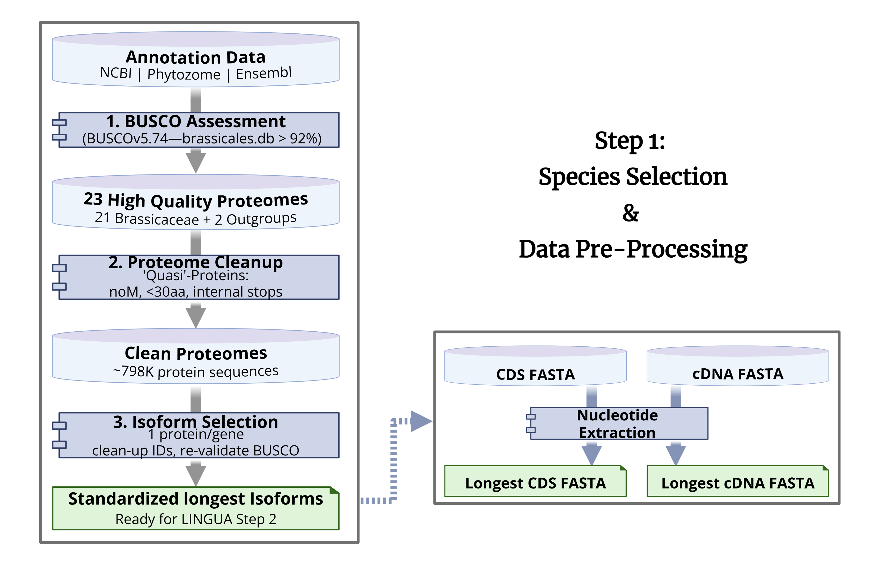

# Protein Preprocessing & Isoform Selection Pipeline

A reproducible framework for generating **high-quality, standardized proteomes** using biologically informed filtering, completeness assessment, and isoform normalization for multi-species comparative genomics.

---

## Rationale

Comparative genomics workflows depend critically on **consistent, high-quality protein datasets**.  
However, publicly available proteomes often contain:

- Redundant isoforms per gene  
- Incomplete or low-quality annotations  
- Non-functional or truncated protein sequences  
- Inconsistencies across databases (NCBI, Ensembl, Phytozome)  

These inconsistencies propagate errors into downstream analyses, including:

- Orthology inference  
- Gene age estimation  
- De novo gene detection  
- Synteny-based validation  

This pipeline addresses these issues by providing a **standardized preprocessing framework** for constructing biologically consistent proteomes.

---

## Methodological Overview

### **1. Annotation Integration & Species Selection**

Proteomes are sourced from:
- NCBI  
- Phytozome  
- Ensembl  

To ensure dataset quality:

- Completeness is evaluated using **BUSCO (Benchmarking Universal Single-Copy Orthologs)**  
- A lineage-specific dataset (e.g., *Brassicales*) is used  
- Only high-quality proteomes (e.g., **>92% completeness**) are retained  

This step enforces **comparability across species** and eliminates low-quality assemblies.

---

### **2. Protein-Level Quality Control**

To remove biologically implausible or low-confidence sequences, the following filters are applied:

- ❌ No start codon (Methionine)  
- ❌ Short sequences (<30 amino acids)  
- ❌ Internal stop codons  

This step produces **clean proteomes** suitable for evolutionary analysis.

---

### **3. Isoform Normalization**

To ensure consistency across gene models:

- The **longest protein isoform per gene** is selected  
- Gene identifiers are standardized  
- Redundant isoforms are removed (1 protein per gene)  

Optional:
- Dataset can be re-evaluated using BUSCO post-filtering  

This step ensures:
- non-redundant gene representation  
- comparable gene sets across species  

---

### **4. Nucleotide Sequence Extraction (Optional)**

To maintain linkage between protein and nucleotide data:

- Longest CDS sequences are extracted  
- Corresponding cDNA sequences are extracted  

This enables downstream analyses requiring nucleotide-level resolution.

---

## Outputs

- **Standardized longest protein isoforms (FASTA)**  
- **Longest CDS sequences (FASTA, optional)**  
- **Longest cDNA sequences (FASTA, optional)**  
- **Summary statistics and QC reports (TSV)**  

These outputs are optimized for:

- Orthology inference (e.g., OrthoFinder)  
- Comparative genomics pipelines  
- De novo gene detection workflows  
- Machine learning applications on genomic data  

---

## Pipeline Overview

### Full LINGUA Workflow



### Step 1: Dataset Curation & Preprocessing



---

## Role in the LINGUA Framework

This repository represents **Stage 1: Dataset Curation and Preprocessing**  
within the LINGUA comparative genomics pipeline:

1. **Dataset Curation (this repository)**  
2. Orthology Analysis (gene clustering across species)  
3. Homolog Exclusion (removal of false positives)  
4. Synteny Validation (genome alignment-based validation)  

While part of a larger framework, this module is:

✅ standalone  
✅ modular  
✅ reusable across datasets and projects  

---

## Quick Start

```bash
bash scripts/longest_protein_pipeline.sh \
 -g example_data/gff \
 -f example_data/protein \
 -o output_dir
```


## Reproducible Example

This repository includes a small test dataset (3 species) for verifying pipeline behavior.

### Dataset contents

- example_data/protein/ → input protein FASTA files  
- example_data/gff/ → gene annotation files  
- example_data/genome/ → genome FASTA files  
- example_data/test_run/ → expected outputs  

---

### Run the pipeline

bash scripts/longest_protein_pipeline.sh \
 -g example_data/gff \
 -f example_data/protein \
 -o test_output

---

### Validate results

diff test_output/master_summary_report.tsv \
 example_data/test_run/master_summary_report.tsv

If no output is returned, the pipeline ran correctly.

---

### Inspect output

head example_data/test_run/final_proteins/Athaliana_final.faa

This file contains the final filtered protein set where:
- each gene has one representative protein  
- sequences passed biological QC filters  

---

## Notes on Example Dataset

This dataset is simplified for demonstration:

- genome FASTA files are truncated  
- GFF annotations are reduced  
- optional features are not fully exercised  

It is intended for:
- quick testing  
- reproducibility checks  
- demonstration purposes  

The pipeline supports full datasets without modification.

---

## Pipeline Components

### Orchestration (scripts/)

- `longest_protein_pipeline.sh` — main pipeline for multi-species preprocessing  
- `qc_pipeline.sh` — wrapper for batch protein quality control  

### Core Utilities (bin/)

- `qc_proteins.py` — filters proteins based on biological criteria  
- `select_longest_proteins.py` — selects the longest isoform per gene  
- `extract_longest_transcripts.py` — extracts CDS and cDNA sequences  
- `fasta_summary.py` — computes FASTA statistics  
- `combine_datasets.py` — merges dataset summaries  

---

## Directory Structure

- bin/ → Python utilities  
- scripts/ → pipeline execution scripts  
- example_data/ → test dataset and expected outputs  
- docs/ → figures and diagrams  
- README.md → project documentation  

---

## Design Principles

- ✅ Modular and reusable components  
- ✅ Reproducible workflows  
- ✅ Scalable to multi-species datasets  
- ✅ Biologically informed quality control  
- ✅ Clean and consistent output formats  

---

## Scope

 Stage 1 — Dataset curation and proteome standardization  

### Planned Extensions

- Orthology analysis (OrthoFinder-based clustering)  
- Homolog filtering (false-positive removal)  
- Synteny validation (genome alignment framework)  

---

## License

MIT License  

---

## Acknowledgements

Casola Lab  
Ecology & Conservation Biology Program  
Texas A&M University  

---

💡 *This pipeline prepares clean, non-redundant protein datasets required for reliable orthology inference, evolutionary analysis, and comparative genomics workflows*
